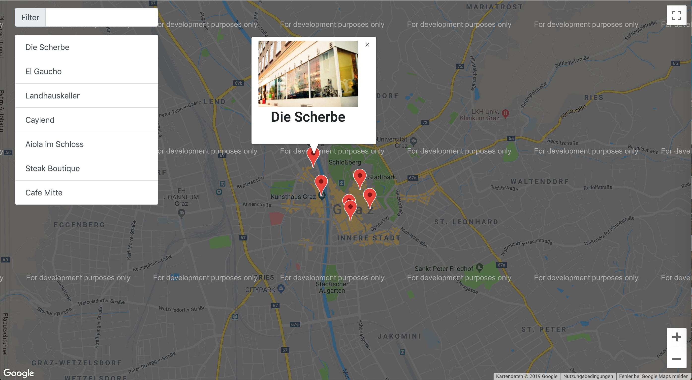

# FEND Neigborhood 
A Udacity project mastering API connection (Google Maps API and Foursquare API) and MVVM based framework knockout.js

## General
This application is about a map, which shows restaurants in Graz/AT. Use the input field on the left side for filtering restaurants on the map.
By clicking an element (in list or a marker itself) the info window pops out and shows an image of Foursquare's API.

### Used frameworks
- jQuery
- knockout.js
- Bootstrap

### Used APIs
- Google Map API [https://cloud.google.com/maps-platform/](https://cloud.google.com/maps-platform/)
- Foursquare API (Only limited access, because of free version) [https://developer.foursquare.com/](https://developer.foursquare.com/)

## Running instructions
1.  Download Repository
2.  Open ```index.html``` in your browser

## Screenshot


